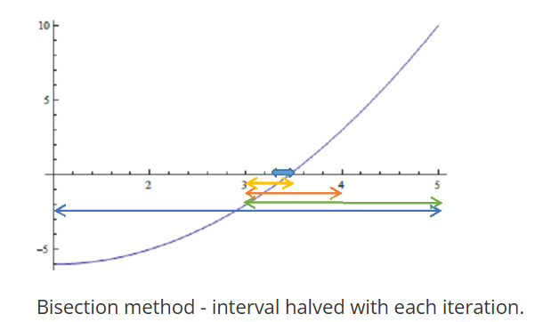

# Bisection Method: Theory and Analysis

## Introduction
The bisection method is a root-finding algorithm used to approximate the roots of a continuous function $f(x)$ within a given interval $[a, b]$. It is a simple, robust, and reliable method that leverages the Intermediate Value Theorem, which states that if $f(a)$ and $f(b)$ have opposite signs, then there exists at least one root $x^*$ in $[a, b]$ such that $f(x^*) = 0$.

## Algorithm
The bisection method iteratively narrows the interval containing the root by halving it in each step. Below is the step-by-step algorithm:

1. **Choose an initial interval $[a_0, b_0]$** such that $f(a_0) \cdot f(b_0) < 0$, ensuring at least one root exists in the interval.
2. **Compute the midpoint**: $c_n = \frac{a_n + b_n}{2}$.
3. **Evaluate $f(c_n)$**:
   - If $f(c_n) = 0$, then $c_n$ is the root, and the algorithm stops.
   - If $f(a_n) \cdot f(c_n) < 0$, the root lies in $[a_n, c_n]$, so set $b_{n+1} = c_n$ and $a_{n+1} = a_n$.
   - If $f(c_n) \cdot f(b_n) < 0$, the root lies in $[c_n, b_n]$, so set $a_{n+1} = c_n$ and $b_{n+1} = b_n$.
4. **Repeat** steps 2–3 until the interval $[a_n, b_n]$ is sufficiently small (i.e., $|b_n - a_n| \leq \text{TOL}$) or a maximum number of iterations is reached.
5. **Return the midpoint** $c_n$ as the approximate root.

*Caption: Bisection method - interval halved with each iteration.*

## Convergence
The bisection method exhibits **linear convergence** with a rate of convergence of $\frac{1}{2}$. Linear convergence is defined for a sequence of iterates $\{x_n : n \geq 0\}$ converging to a root $x^*$ if $|x_{n+1} - x^*| \leq c |x_n - x^*|^p, n \geq 0$, where $p = 1$ for linear convergence, and $c < 1$ is the asymptotic error constant. For the bisection method, the error bound is halved in each iteration: $|x_n - x^*| \leq \frac{1}{2^n} |b_0 - a_0|$, where $x_n$ is the midpoint of the interval $[a_n, b_n]$ at iteration $n$, and $|b_0 - a_0|$ is the width of the initial interval. This is derived as follows:

- Initial error bound: $|x_1 - x^*| \leq \frac{1}{2} |x_0 - x^*|$.
- After $n$ iterations: $|x_n - x^*| \leq \left(\frac{1}{2}\right)^n |b_0 - a_0|$.

The constant $c = \frac{1}{2}$ indicates that the error is reduced by half with each iteration, confirming linear convergence.

### Stopping Criteria
To ensure the root is within a specified tolerance $\text{TOL}$, the number of iterations $n$ required is determined by:

$$
\frac{|b_0 - a_0|}{2^n} \leq \text{TOL},
$$

$$
2^n \geq \frac{|b_0 - a_0|}{\text{TOL}},
$$

$$
n \geq \frac{\log(|b_0 - a_0|) - \log(\text{TOL})}{\log(2)}.
$$

This formula allows users to compute the minimum number of iterations needed to achieve the desired accuracy.

## Advantages
1. **Guaranteed Convergence**: The bisection method is a bracketing method, meaning it always converges to a root as long as the initial interval $[a, b]$ contains a root (i.e., $f(a) \cdot f(b) < 0$).
2. **Controlled Error**: The error decreases by half with each iteration, allowing precise control over the accuracy of the root by adjusting the number of iterations.
3. **Simple Calculations**: The method only requires evaluating the function at the midpoint and comparing signs, avoiding complex computations like derivatives.

## Disadvantages
1. **Slow Convergence**: The linear convergence rate ($c = \frac{1}{2}$) makes the bisection method slower compared to methods like Newton-Raphson, which can achieve quadratic convergence.
2. **Single Root Requirement**: The method assumes there is exactly one root in the initial interval $[a, b]$. If multiple roots exist or the function does not change sign, the method may fail to identify the correct root.

## Conclusion
The bisection method is a reliable and straightforward approach for finding roots of continuous functions. Its guaranteed convergence and simplicity make it an excellent choice for problems where robustness is prioritized over speed. However, its slow convergence and requirement for a single root within the interval limit its efficiency for complex problems. Understanding its convergence properties and limitations allows users to apply it effectively in appropriate scenarios.
